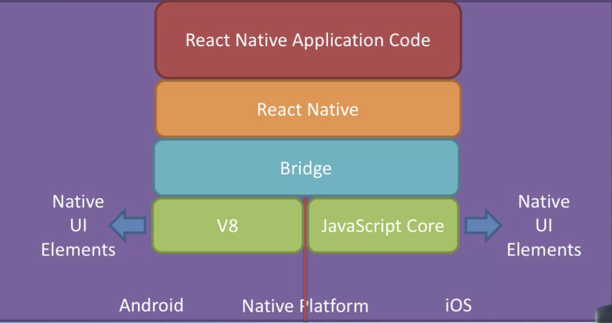

# Introduction
1. [Hybrid Mobile App Development](#hybrid-mobile-app-development)
2. [React Native](#react-native)
3. [React Native App](#react-native-app)
4. [React Native Components](#react-native-components)

## Hybrid Mobile App Development
### App Implementation Approaches
#### Native Apps
- Platform-specific skills
- Highest performance
- Full access to device capabilities

#### Mobile Web Application
- Fully hosted in the mobile browser
- Slowest
- No access to device capabilities

#### Hybrid with WebView
- WebView: HTML, CSS and JavaScript base runs in internal browswer
- Wrapped in a native app
- Embeddedw web view based with partial implementation in native code
- Some access to device capabilities
- Slower than native
- Example: Ionic Framework + Cordova/Phonegap, Trigger.io

#### Compiled/Interpreted/VM (Virtual Machine) Hybrid
- Makes use of Native UIs with native platform's rendering engine, not WebViews
- Near-native performance
- Most access to device capabilities
- The code is written in one language and compiled to native code/ run on VM for each supported platform, resulting in a native app for each platform
- Example: React Native, NativeScript

### Hybrid Mobile App Development Frameworks
- Frameworks tagetting HTML5 content like Ionic + Cordova/Phonegap (JS byte code)
- Frameworks like React Native, NativeScript that render the UI using the platform's native controls but still working via JS
- Free Frameworks aiming to produce real native code like Unity
- Commercial Frameworks aiming to produce real native code like Xamarin, Embarcadero

### Usage
- Advantages
  - Use existing skills
  - One code base for multiple platforms
  - Easily design for various form factors using responsive web design
- Drawbacks
  - Performance issues for certain types of apps like 3D games
- Usage
  - Suitable for content-driven apps
    - Business and Productivity
    - Enterprise
    - Media
  
## React Native
_Build native mobile app using JavaScript and React_
- Cross-platform, native iOS and Android apps without  web views
- Focus on front-end
- Hot Reloading: reflect changes immediately
- Backed by Facebook

### Hybrid Mobile Development


### App Development
1. Installing React Native Development Tools
```shell
npm install create-react-native-app -g
```
2. Scaffolding an App
```shell
create-react-native-app <app name>
```
3. Gives access to Expo SDK

## React Native App
-  `<Text>`: display text
- Inline JavaScript based styling
  -  `StyleSheet`: construct a stylesheet

## React Native Components
```shell
yarn add react-native-elements
```
