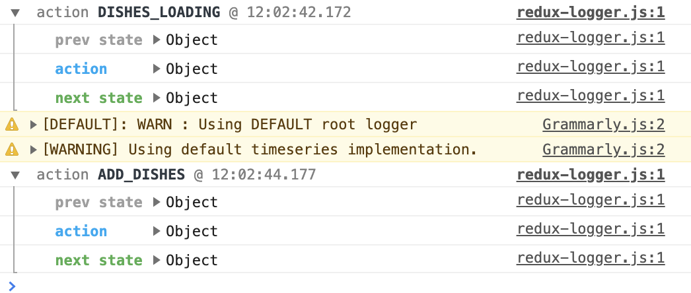

# [Code] More Redux and Client-Server Communication
1. [Combining Reducers](#combining-reducers)
2. [Redux Actions](#redux-actions)
3. [Redux Thunk](#redux-thunk)
4. [React Redux Form](#react-redux-form)
5. [Setting up a Server](#setting-up-a-server)
6. [Fetch from Server](#fetch-from-server)
7. [React Animations](#react-animations)

## Combining Reducers
1. Create a reducer function for each model and delete the `reducer.js` file
```js
// reducer that only manages dishes

import { DISHES } from '../shared/dishes';

export const Dishes = (state = DISHES, action) => {
  switch(action.type) {
    default:
      return state;
  }
}
```
2. Import reducers to `configureStore.js`
```js
import { Dishes } from './dishes';
import { Comments } from './comments';
import { Promotions } from './promotions';
import { Leaders } from './leaders';
```
3. Import `combineReducers` method
```js
import { combineReducers } from 'redux';`
```
4. Implement `combineReducers`
```js
const store = createStore(
  combineReducers({
    dishes: Dishes,
    comments: Comments,
    promotions: Promotions,
    leaders: Leaders
  })
);
```
## Redux Actions
1. Create a `ActionTypes.js` to define various action types by using string constants
```js
export const ADD_COMMENT = 'ADD_COMMENT';
```
2. Create a `ActionCreators.js` and import ActionTypes
```js
import * as ActionTypes from './ActionTypes';
```
3. Create a Action object in `ActionCreators.js`
```js
export const addComment = (dishId, rating, author, comment) => ({
  type: ActionTypes.ADD_COMMENT,
  payload: {   // contains data sent back
    dishId: dishId,
    ...
  }
})
```
4. Implement the reducer function
```js
export const Comments = (state = COMMENTS, action) => {
  switch(action.type) {
    case ActionTypes.ADD_COMMENT:
      var comment = action.payload;
      ...
      return state.concat(comment);    // pushes new comment and returns
    default:
      return state;
  }
}
```
5. Make the action available within components
- obtain action object
```js
import { addComment } from '../redux/ActionCreators';
```
- dispatch the action
```js
const mapDispatchToProps = (dispatch) => ({
  addComment: (dishId, rating, author, comment) => 
        dispatch(addComment(dishId, rating, author, comment))
});
```
- make the action function available within the component
```js
export default withRouter(connect(mapStateToProps, mapDispatchToProps)(Main));
```
- pass in the action function to the elements, to dispatch the action to the store
```js
<DishDetail dish={...}
            addComment={this.props.addComment}
/> 
```

## Redux Thunk
_Log all the changes to the Redux store into the console_
1. Install the packages
```shell
npm install redux-thunk redux-logger
```
- redux-logger: prints out all actions that are dispatched


2. In `configureStore.js`
```js
import { applyMiddleware } from 'redux';
import thunk from 'redux-thunk';
import logger from 'redux-logger';
```
3. Apply applyMiddleware to the store, to make thunk and logger available to the application
```js
applyMiddleware(thunk, logger)
```
4. Add more action types in `ActionTypes.js`
```js
export const DISHES_LOADING = 'DISHES_LOADING';
export const DISHES_FAILED = 'DISHES_FAILED';
export const ADD_DISHES = 'ADD_DISHES';
```
5. Create `fetchDishes` action in `ActionCreators.js`
```js
export const fetchDishes = () => (dispatch) => {
  // first dispatch
  dispatch(dishesLoading(true));
  // after 2000 secs, second dispatch: pushes new dishes
  setTimeout(() => {
    dispatch(addDishes(DISHES))
  }, 2000);
}
```
6. Modify the `Dishes` reducer
```js
export const Dishes = (state = {
  isLoading: true,
  errMess: null,
  dishes: []
}, action) => {
  switch(action.type) {
    case ActionTypes.ADD_DISHES:
      return {...state, 
        isLoading: false,
        errMess: null,
        dishes: action.payload};
    ...
  }
}
```
7. Dispatch `fetchDishes` in component
```js
const mapDispatchToProps = (dispatch) => ({
  ...,
  fetchDishes: () => {dispatch(fetchDishes())}
});
```
8. Make use of the `fetchDishes`
```js
componentDidMount() {
    this.props.fetchDishes();
}
```
9. Modify how to pass info to child component

From
```js
<Home dish={this.props.dishes} />
```
To
```js
<Home dish={this.props.dishes.dishes} 
      dishesLoading={this.props.dishes.isLoading}
      dishesErrMess={this.props.dishes.errMess}
   />
```

## React Redux Form
_When moving to other pages, the previous filled info will still remain filled_
1. Add a new file named forms.js in the redux folder
```js
export const InitialFeedback = {
    firstname: '',
    lastname: '',
    telnum: '',
    email: '',
    agree: false,
    contactType: 'Tel.',
    message: ''
};
```
2. Configure Redux to store the form
- import `createForms` to enable add the from state into the store
```js
import { createForms } from 'react-redux-form';
```
- add reducer functions and state information into create store
- no need to write reducers / action creators, the package takes care of them
```js
combineReducers({
  ...
  ...createForms({
    feedback: InitialFeedback
  })
})
```
3. Make use of the action
```js
import { actions } from 'react-redux-form';
```
- Dispatch the action
```js
const mapDispatchToProps = (dispatch) => ({
  ...
  resetFeedbackForm: () => { dispatch(actions.reset('feedback'))}
});
```
- Send the attribute to the child component as props
```js
<Contact resetFeedbackForm={this.props.resetFeedbackForm} />
```
4. Create the form
```js
import { Control, Form , Errors, actions } from 'react-redux-form';
```
- modify `handleSubmit()`
```js
handleSubmit(values) {
    ...
    this.props.resetFeedbackForm();
}
```
- change `<LocalForm>` to 
```js
<Form model="feedback">
```

## Setting up a Server
_using json-server_
1. Create a `json-server` folder
2. Install `json-server`
- `-g`: global module
```shell
sudo npm install -g json-server
```
3. Move `db.json` to the folder
4. Create a  `public` folder in `json-server` and move the  `image` folder to `public`
5. Keep json-server watch the update in `db.json` file
- `-d 2000`: will serve the updated data back to the requester after a 2 seconds delay, simulate delay in accessing a server over the Internet
- `-p 3001`: run on port 3001
```shell
json-server --watch db.json -d 2000 -p 3001
```
6. Verify the server is running
- go to `http://localhost:3001/dishes`

## Fetch from Server
1. install packages
```shell
npm install cross-fetch`
```
2. Run the server
```shell
json-server --watch db.json -d 2000 -3001
```
3. Create a `baseUrl.js` file in shared folder to set up communication with server
```js
export const baseUrl = 'http://localhost:3001/;'
```
4. In `ActionCreators.js`
- import `baseUrl` to configure server
```js
import { baseUrl } from '../shared/baseUrl';
```
- remove simulation of server communication (`setTimeOut`)
- configure the `fetchDishes()` action to fetch from server
```js
export const fetchDishes = () => (dispatch) => {
  ...  
  return fetch(baseUrl + 'dishes')
            .then(response => response.json()) // convert response to json
            .then(dishes => dispatch(addDishes(dishes)));
};
```
5. Fetch image from server
```js
<CardImg width="100%" src={baseUrl + dish.image} alt={dish.name} />
```
6. Handling Errors
```js
return fetch(baseUrl + 'dishes')
            .then(response => {
              if (response.ok) {
                return response
              }
              else {
                var error = new Error('Error ' + response.status + ': ' + response.statusText);
                error.response = response;
                throw error;
              }
            },
            // if no respond from the server
            error => {
              var errmess = new Error(error.message);
              throw errmess
            })
            .then(...)
            .catch(error => dispatch(dishesFailed(error.message)));
```
